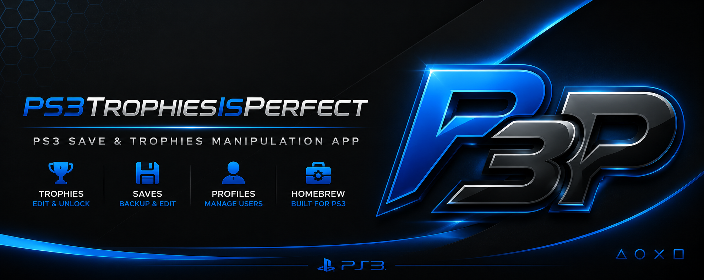
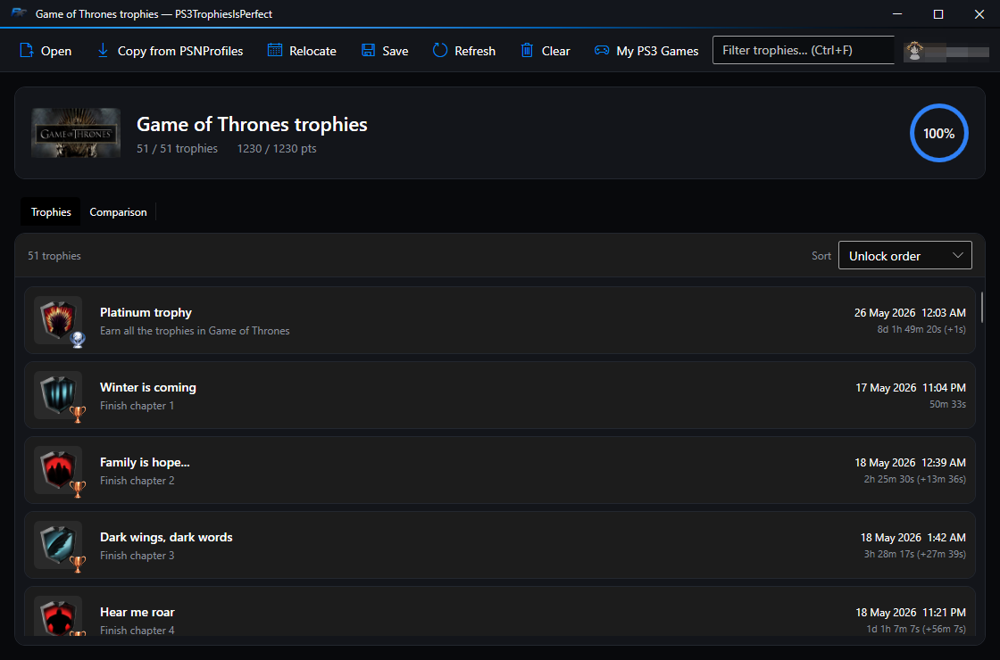
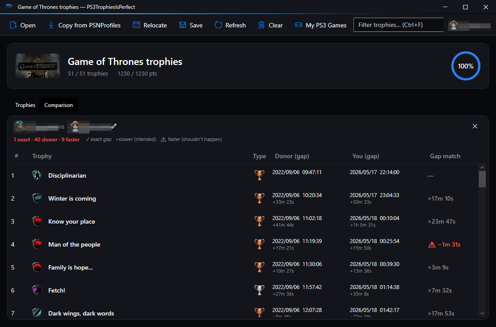
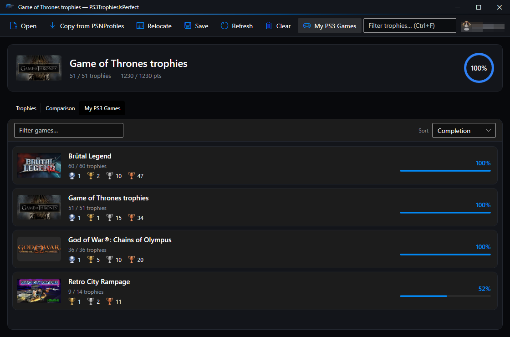

<div align="center">



# PS3TrophiesIsPerfect

A ground-up redesign of a PlayStation 3 trophy timestamp editor — modern Fluent UI, PSNProfiles cloning, and a legit-pacing relocation engine.

[![][license-shield]][license-link]
[![][platform-shield]][platform-link]
[![][framework-shield]][framework-link]
[![][last-commit-shield]][last-commit-link]
[![][stars-shield]][stars-link]

</div>

> [!IMPORTANT]
> **This is a personal hobby project.** It's published in case it's useful to anyone else, but:
> - **No support** is provided.
> - **No issues, pull requests, or feature requests** will be reviewed or accepted.
> - **No releases, binaries, or downloads** are published — build it yourself from source.
> - Use entirely **at your own risk.** See [Risks](#risks) before doing anything with this.

---

## What this is

A Windows trophy editor for the PlayStation 3. Open a trophy folder copied off a console, edit unlock timestamps, optionally re-sign it for a different account, and copy it back.

**PS3TrophiesIsPerfect is a complete, ground-up redesign** of the older `PS3TrophyIsGood` fork — a brand-new WPF front end, a streamlined PSNProfiles-only cloning workflow, and a side-by-side comparison view, built on top of the same proven save-file engine.

## A complete redesign

The lineage: darkautism wrote the original (Chinese) PS3 trophy editor and, crucially, reverse-engineered the encrypted trophy save format. `PS3TrophyIsGood` was an English rewrite of that. **PS3TrophiesIsPerfect** is a rebuild of the *application* around that engine:

- **New UI from scratch** — a modern, Fluent dark interface (WPF), replacing the old Win7-era WinForms shell. Custom window chrome, real trophy artwork, a live completion ring, animated in-app dialogs.
- **PSNProfiles-first workflow** — clone a real player's run directly from their profile page (the older local-JSON / `psntrophyleaders` paths are gone).
- **Legit-pacing relocation** — rebuilds a cloned run into believable nightly play sessions in a date window you choose.
- **Side-by-side comparison** — verify your clone against the donor's actual order and gaps.
- **Quality-of-life everywhere** — profile picker, remembered last folder/window, keyboard shortcuts, search, sorting, per-trophy right-click, themed dialogs.

> The save-file engine — `TROPHYParser` / `BigEndianTool`, the part that actually reads and writes the encrypted trophy format — is darkautism's original work and is used **completely unchanged.** That was the hard part, and it's entirely his. See [Credits](#credits).

## Screenshots

<div align="center">

**Trophies** — the editable trophy list with real artwork, unlock times and per-gap spacing.



**Comparison** — a merged diff of your run against the donor's, with a gap verdict per trophy.



**My PS3 Games** — your PS3 library from Sony's own data: art, trophy-type counts and completion.



<sub>(account and profile names redacted)</sub>

</div>

## Features

- **Modern Fluent dark UI** — game icon + title + completion-percentage ring, color-coded rows (earned / synced / locked), filter box, sortable columns.
- **Open** a trophy folder by drag-and-drop or the Open button; trophies load with their real artwork.
- **Edit timestamps** — set, change, or lock individual trophies (double-click or right-click); or clear them all.
- **Re-sign** a trophy folder for a different account — drop a `*.SFO` into `profiles/` and pick it when saving.
- **Copy from PSNProfiles** — scrape a player's earned trophies straight from their profile (Cloudflare handled via a bundled FlareSolverr), matched to your game **by name** so cosmetic title differences don't break it.
- **Night-session relocation** — rebuilds the cloned run as realistic nightly sessions from a start date through today:
  - exact burst gaps preserved (stacked/story pops stay identical),
  - every other gap **slower** than the donor, never faster,
  - platinum earned "just now," and **nothing ever dated in the future.**
- **Donor comparison** — a merged diff view: each trophy with the donor's time/gap next to your applied time/gap, and a verdict (`✓ exact` for bursts, `+slower` where intended, `⚠ faster` flagged red).
- **Remembers** your last folder, window size/position, and selected profile between runs.

## Build

Requires the **.NET SDK** and the **.NET Framework 4.8** targeting pack (ships with Visual Studio 2019+ / Build Tools).

```sh
git clone https://github.com/trippixn963/PS3TrophiesIsPerfect.git
cd PS3TrophiesIsPerfect
dotnet build PS3TrophiesIsPerfect/PS3TrophiesIsPerfect.csproj -c Debug
```

`pfdtool` (encryption) is bundled. For **Copy from PSNProfiles**, a `flaresolverr/` folder must sit next to the built `.exe`. Launch the app **non-elevated** (a normal double-click) — running it as administrator blocks folder drag-and-drop.

No prebuilt binary is provided.

## Risks

Read this before touching anything.

- **Modifying trophies and syncing them to PSN can get your account permanently banned.**
- Trophies can become corrupted.
- The sync can fail mid-way and leave a profile in a bad state.
- Your console ID (IDPS) can be flagged.
- Syncing a **future-dated** trophy is an instant flag — the relocation engine guards against it, but you are still responsible for what you sync.

If any of that happens: there is no recovery, no recourse, and no help available here. Don't run this on an account or console you care about.

## Usage

The program bundles `pfdtool` and handles encryption/decryption itself — **do not decrypt anything manually.** After editing, **Save** re-encrypts the folder.

Row colors:

| Row | Meaning |
|---|---|
| Dimmed | Not obtained |
| Normal | Obtained, not yet synced to PSN |
| Rose tint | Already synced to PSN (can't be edited) |

### Opening a file

Drag the trophy folder onto the window (or use **Open**). It loads automatically.

## Walkthrough

If the trophies have never been synced to PSN before, set the console ID and user ID correctly first. Console ID lives in `global.conf`.

**1.** Copy the trophy folder off the PS3 — it's at `/dev_hdd0/home/000000XX/trophy/`.

**2.** Open the program and drag the folder onto it.

**3.** (Optional) **Copy from PSNProfiles**, relocate to a date window, and review the comparison tab.

**4.** Edit as needed, **Save**, then copy the trophy folder back to the console. **Back up first.**

**5.** Sync to PSN. **This is the dangerous step.** Re-read [Risks](#risks). A sync error mid-process is common; trophies usually appear afterward anyway.

## Troubleshooting (one entry)

**HTTP 403 / 500 fetching timestamps** — Cloudflare is blocking the scrape. Drop in the latest FlareSolverr from its [releases](https://github.com/FlareSolverr/FlareSolverr/releases), replacing the bundled folder.

That's the only troubleshooting note. Anything else, you're on your own.

## Credits

- **[darkautism](https://github.com/darkautism)** — the original PS3 trophy editor and, more importantly, the reverse-engineering of the encrypted trophy save format (`TROPHYParser`). That engine is the hard part and is used here **unchanged**. This project is a redesign of the application around his work. Original work © 2016 darkautism.
- **`PS3TrophyIsGood`** — the English rewrite this redesign grew out of.
- **flatz** — `pfdtool`, used for trophy encryption/decryption.
- **[FlareSolverr](https://github.com/FlareSolverr/FlareSolverr)** — Cloudflare bypass for the PSNProfiles scrape.

## License

MIT — see [LICENSE](LICENSE). Original work © 2016 darkautism.

<!-- Shields -->
[license-shield]: https://img.shields.io/badge/license-MIT-blue?style=flat-square
[license-link]: ./LICENSE
[platform-shield]: https://img.shields.io/badge/platform-Windows-0078D6?style=flat-square&logo=windows&logoColor=white
[platform-link]: #build
[framework-shield]: https://img.shields.io/badge/.NET%20Framework-4.8-512BD4?style=flat-square&logo=dotnet&logoColor=white
[framework-link]: #build
[last-commit-shield]: https://img.shields.io/github/last-commit/trippixn963/PS3TrophiesIsPerfect?style=flat-square&color=success
[last-commit-link]: https://github.com/trippixn963/PS3TrophiesIsPerfect/commits/main
[stars-shield]: https://img.shields.io/github/stars/trippixn963/PS3TrophiesIsPerfect?style=flat-square&color=ffcb47
[stars-link]: https://github.com/trippixn963/PS3TrophiesIsPerfect/stargazers
